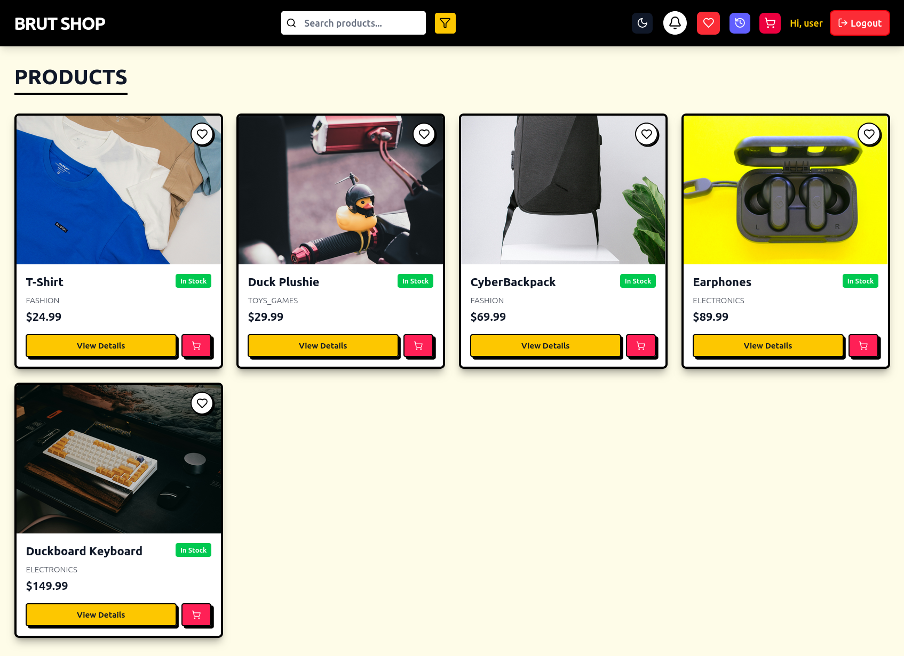

# 🛒 BrutShop — Full-Stack E-Commerce Platform

A **Neo-brutalist styled full-stack e-commerce application** built with **React 19 + Vite** and **Spring Boot 3**, supporting JWT auth, role-based access, image uploads via Cloudinary, cart management using DTOs, and a beautifully brutal UI.

## 📸 Preview



## 🔧 Tech Stack

### Frontend
- **React 19** (Vite)
- **Tailwind CSS** (Neo-brutalist theme)
- **Lucide Icons**
- **React Router DOM**
- **Axios** for API calls
- **Sonner** for toast notifications
- **JWT** token storage and AuthContext
- **Custom Dark Mode** using ThemeContext

### Backend
- **Spring Boot 3**
- **Spring Security + JWT**
- **Supabase PostgreSQL** (via session pooler)
- **Role-based authorization (`USER`, `ADMIN`)**
- **Cloudinary** for image uploads
- **DevSeeder** to auto-populate dummy products
- **DTO-based responses for cart**

## ✨ Features

### 👨‍💻 Auth
- JWT-based login/signup
- Auto-login after signup
- AuthContext session management
- Role-based protected routes
- JWT stored in localStorage

### 🛍 Product
- Product grid + search
- Product detail view with base64 image fallback
- Admin-only add/edit/delete
- Cloudinary image upload with size validation

### 🛒 Cart
- Sliding cart drawer
- Add/update/remove item with toast feedback
- Cart badge updated dynamically via Context
- Cart data uses DTO for lightweight frontend sync

### 🖼 Image Storage
- Uploaded images stored in **Cloudinary**
- Products seed with fallback images from `https://picsum.photos`

## 🔌 Supabase Config

Backend now uses Supabase's PostgreSQL instance via session pooler:

```
spring.datasource.url=jdbc:postgresql://aws-0-ap-south-1.pooler.supabase.com:5432/postgres
spring.datasource.username=postgres.ydbfnjazmakafysarhfh
spring.datasource.password=6fs3KRHXY0NSdiPp
```

## 🚀 Getting Started

### Backend

```bash
cd Backend

# Configure application.properties as shown above

./mvnw spring-boot:run
```

> 🔁 `DevSeeder.java` inserts sample products on first boot

### Frontend

```bash
cd Frontend
npm install
npm run dev
```

## 🧠 Folder Structure

```
E-commerce/
├── Backend/
│   └── src/main/java/com/anish/e_commerce/
├── Frontend/
│   └── src/components/
│   └── src/context/
└── README.md
```

## 📝 License

MIT — Feel free to modify and use. Credit appreciated.

> Made with 💀 and ☕ by [Anish Kumar](https://github.com/Sarcastic-Soul)