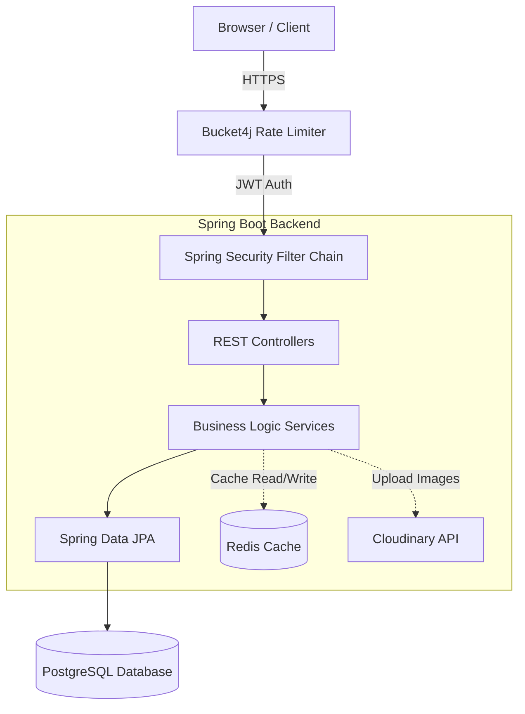

# 🛒 BrutShop — Full-Stack E-Commerce Platform

A **Neo-brutalist styled full-stack e-commerce application** built with **React 19 + Vite** and **Spring Boot 3**. It features robust JWT auth, role-based access, an order management system, a wishlist & notification engine, dynamic product filtering, server-side pagination, Redis caching, API rate limiting, and a beautifully brutal UI.

## 🌐 Live Demo & Access

Just want to see the app in action?

- **🔗 Live Website:** [https://springboot-ecommerce-latest-ctgu.onrender.com/](https://springboot-ecommerce-latest-ctgu.onrender.com/)
- **📖 API Documentation (Swagger):** [https://springboot-ecommerce-latest-ctgu.onrender.com/swagger-ui/index.html](https://springboot-ecommerce-latest-ctgu.onrender.com/swagger-ui/index.html)
- **📺 Demo Video:** [INSERT_YOUR_YOUTUBE_LINK_HERE]

> ⚠️ **HEADS UP:** This project is hosted on Render's free tier. If the site hasn't received traffic in a while, the server goes to sleep. **It may take 2-5 minutes to spin up on your first visit.** If it seems stuck loading, just give it a minute! Alternatively, check out the demo video above to see its performance.

### 🔑 Demo Credentials

You can log in and test the features using these pre-configured accounts:

- **Standard User:** Username: `user` | Password: `user123`
- **Admin User:** Username: `admin` | Password: `admin123`

---

## 📸 Preview

  

---

## 🏛 System Architecture


```mermaid
graph TD
    Client[Browser / Client] -->|HTTPS| RateLimiter[Bucket4j Rate Limiter]
    RateLimiter -->|JWT Auth| Security[Spring Security Filter Chain]
    
    subgraph Spring Boot Backend
        Security --> Controllers[REST Controllers]
        Controllers --> Services[Business Logic Services]
        Services --> Repositories[Spring Data JPA]
        
        Services -.->|Cache Read/Write| Redis[(Redis Cache)]
        Services -.->|Upload Images| Cloudinary[Cloudinary API]
    end
    
    Repositories --> Database[(PostgreSQL Database)]
```

---

## 🔧 Tech Stack

### Frontend
- **React 19** (Vite)
- **Tailwind CSS** (Neo-brutalist theme)
- **Lucide Icons** & **Recharts** (Admin Data Visualization)
- **React Router DOM**
- **Axios** for API calls & **Sonner** for toast notifications
- **JWT** token storage and AuthContext

### Backend
- **Spring Boot 3** (Java 21)
- **Spring Security + JWT** (Role-based authorization: `USER`, `ADMIN`)
- **Bucket4j** (IP-based API Rate Limiting)
- **PostgreSQL** (Local pgAdmin for Dev, NeonDB for Prod)
- **Redis** for high-performance API caching
- **Cloudinary** for image uploads
- **JUnit 5 & Mockito** for unit and integration testing

### DevOps & Deployment
- **Docker** (Multi-stage build compiling React into the Spring Boot JAR as a Monolith)
- **GitHub Actions** for automated CI/CD pipeline
- **Render** for production hosting

---

## ✨ Features

### 👨‍💻 Auth & Security
- JWT-based login/signup with auto-login and session management.
- Role-based protected routes (`ADMIN` vs `USER`).
- **API Rate Limiting:** Public endpoints are protected by Bucket4j token-bucket algorithms to prevent bot scraping and brute-force attacks.

### 🛍 Products & Discovery
- **Server-Side Pagination:** Efficiently browse catalogs with Spring Data `Pageable`.
- Product grid with **Debounced Search** and **Redis Caching** for instant load times.
- **Dynamic Brutalist Filter Drawer** (Filter by Category, Price Range, and Sorting).
- **Wishlist System:** Users can save products, triggering instant UI updates.

### 🛒 Cart & 📦 Orders
- Sliding cart drawer with dynamic Context badge.
- **Checkout System:** Convert carts into immutable orders. Inventory automatically deducts.
- **Order History:** Users can track their past orders, totals, and statuses.

### 🔔 Real-Time Notifications
- When an admin restocks a product from `0` to `>=1`, all users who wishlisted the item receive an instant "Back in Stock" notification.

### 📊 Admin Dashboard
- Global platform statistics (Total Users, Products, Orders).
- **Interactive Line Chart** mapping order trends over time using Recharts.

---

## 💻 Local Development Setup

### Prerequisites
- Java 21
- Node.js (v18+)
- PostgreSQL installed locally (or via Docker)
- Redis installed locally (or via Docker: `docker run -p 6379:6379 redis`)
- Cloudinary Account (for image uploads)

### 1. Backend Setup
The backend uses Spring Profiles. Locally, it defaults to the `dev` profile.

1. Open `backend/src/main/resources/application-dev.properties`.
2. Ensure your local Postgres credentials are correct.
3. Add your Cloudinary credentials and JWT Secret to your environment variables or properties file.
4. Run the backend:
```bash
cd backend
./mvnw spring-boot:run -Dspring-boot.run.profiles=dev
```

### 2. Frontend Setup
In local development, Vite is configured to proxy `/api` requests to `localhost:8080`, bypassing CORS issues seamlessly.
```bash
cd frontend
npm install
npm run dev
```

---

## 🚀 Clone & Deploy (CI/CD)

This project is configured with a fully automated CI/CD pipeline. When you push to the `main` branch, GitHub Actions builds a **Monolith Docker Image** and pushes it to Docker Hub. Deploy to Render using your Docker Hub image, setting the necessary environment variables (`SPRING_PROFILES_ACTIVE=prod`, `DB_URL`, `REDIS_URL`, etc.).

---

## 🧪 Running Tests

- **Backend:** Run `./mvnw test` in the `/backend` directory to execute the JUnit 5 and Mockito test suites (testing Services, Security, and Business Logic).

## 📝 License
MIT — Feel free to modify and use. Credit appreciated.

> Made by [Anish Kumar](https://github.com/Sarcastic-Soul)
