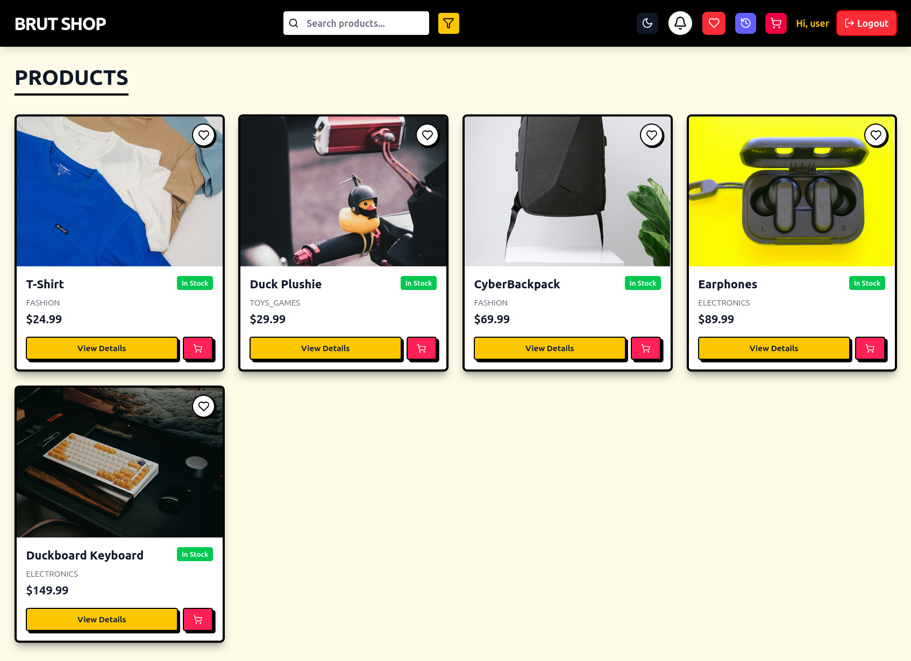

# 🛒 BrutShop — Full-Stack E-Commerce Platform

A **Neo-brutalist styled full-stack e-commerce application** built with **React 19 + Vite** and **Spring Boot 3**. It features robust JWT auth, role-based access, an order management system, a wishlist & notification engine, dynamic product filtering, Redis caching, and a beautifully brutal UI.

## 🌐 Live Demo & Access

Just want to see the app in action?

- **🔗 Live Website:** https://springboot-ecommerce-latest-ctgu.onrender.com/
- **📺 Demo Video:** [Link to your YouTube/Loom video]

> ⚠️ **HEADS UP:** This project is hosted on Render's free tier. If the site hasn't received traffic in a while, the server goes to sleep. **It may take 2-5 minutes to spin up on your first visit.** If it seems stuck loading, just give it a minute\! Alternatively, check out the demo video above to see its performance.

### 🔑 Demo Credentials

You can log in and test the features using these pre-configured accounts:

  - **Standard User:** Username: `user` | Password: `user123`
  - **Admin User:** Username: `admin` | Password: `admin123`

-----

## 📸 Preview

 

## 🔧 Tech Stack

### Frontend

  - **React 19** (Vite)
  - **Tailwind CSS** (Neo-brutalist theme)
  - **Lucide Icons** & **Recharts** (Admin Data Visualization)
  - **React Router DOM**
  - **Axios** for API calls & **Sonner** for toast notifications
  - **JWT** token storage and AuthContext

### Backend

  - **Spring Boot 3** (Java 21)
  - **Spring Security + JWT** (Role-based authorization: `USER`, `ADMIN`)
  - **PostgreSQL** (Local pgAdmin for Dev, NeonDB for Prod)
  - **Redis** for high-performance API caching
  - **Cloudinary** for image uploads
  - **JUnit 5 & Mockito** for unit and integration testing

### DevOps & Deployment

  - **Docker** (Multi-stage build compiling React into the Spring Boot JAR as a Monolith)
  - **GitHub Actions** for automated CI/CD pipeline
  - **Render** for production hosting

-----

## ✨ Features

### 👨‍💻 Auth & Security

  - JWT-based login/signup with auto-login and session management.
  - Role-based protected routes (`ADMIN` vs `USER`).

### 🛍 Products & Discovery

  - Product grid with **Debounced Search** and **Redis Caching** for instant load times.
  - **Dynamic Brutalist Filter Drawer** (Filter by Category, Price Range, and Sorting).
  - **Wishlist System:** Users can save products, triggering instant UI updates.
  - Admin-only add/edit/delete capabilities.

### 🛒 Cart & 📦 Orders

  - Sliding cart drawer with dynamic Context badge.
  - **Checkout System:** Convert carts into immutable orders. Inventory automatically deducts on purchase.
  - **Order History:** Users can track their past orders, totals, and statuses.

### 🔔 Real-Time Notifications

  - When an admin restocks a product from `0` to `>=1`, all users who wishlisted the item receive an instant "Back in Stock" notification in their Navbar bell.

### 📊 Admin Dashboard

  - Global platform statistics (Total Users, Products, Orders).
  - **Interactive Line Chart** mapping order trends over time using Recharts.

-----

## 💻 Local Development Setup

### Prerequisites

  - Java 21
  - Node.js (v18+)
  - PostgreSQL installed locally (or via Docker)
  - Redis installed locally (or via Docker: `docker run -p 6379:6379 redis`)
  - Cloudinary Account (for image uploads)

### 1\. Backend Setup

The backend uses Spring Profiles. Locally, it defaults to the `dev` profile.

1.  Open `backend/src/main/resources/application-dev.properties`.
2.  Ensure your local Postgres credentials are correct:

<!-- end list -->

```properties
spring.datasource.url=jdbc:postgresql://localhost:5432/brutshop
spring.datasource.username=postgres
spring.datasource.password=your_password
```

3.  Add your Cloudinary credentials and JWT Secret to your environment variables or properties file.
4.  Run the backend:

<!-- end list -->

```bash
cd backend
./mvnw spring-boot:run -Dspring-boot.run.profiles=dev
```

> 🔁 `DevSeeder.java` auto-inserts sample products and the default users on first boot.

### 2\. Frontend Setup

In local development, Vite is configured to proxy `/api` requests to `localhost:8080`, bypassing CORS issues seamlessly.

```bash
cd frontend
npm install
npm run dev
```

-----

## 🚀 Clone & Deploy (CI/CD)

This project is configured with a fully automated CI/CD pipeline. When you push to the `main` branch, GitHub Actions builds a **Monolith Docker Image** (React built and served from inside Spring Boot) and pushes it to Docker Hub.

Here is how to clone and deploy this yourself:

### Step 1: Set up GitHub Secrets

Before pushing code, you must give GitHub Actions permission to push to your Docker Hub account.

1.  Go to your GitHub Repository -\> **Settings** -\> **Secrets and variables** -\> **Actions**.
2.  Add the following **Repository Secrets**:
      * `DOCKER_USERNAME`: Your Docker Hub username.
      * `DOCKER_PASSWORD`: Your Docker Hub Personal Access Token (PAT) or password.

### Step 2: Trigger the Build

Simply commit and push your code to the `main` branch.

```bash
git push origin main
```

Go to the **Actions** tab in GitHub to watch it build and push the image to Docker Hub (e.g., `yourusername/brutshop-fullstack:latest`).

### Step 3: Deploy on Render

1.  Create an account on [Render](https://www.google.com/search?q=https://render.com/) and [NeonDB](https://www.google.com/search?q=https://neon.tech/).
2.  In Render, click **New +** -\> **Web Service** -\> **Deploy an existing image from a registry**.
3.  Enter your Docker Hub image URL (e.g., `docker.io/yourusername/brutshop-fullstack:latest`).
4.  Set the **Environment Variables** in Render:

| Key | Value | Notes |
| :--- | :--- | :--- |
| `SPRING_PROFILES_ACTIVE` | `prod` | **Crucial:** Forces Spring to use production settings. |
| `DB_URL` | `jdbc:postgresql://...` | Your NeonDB connection string. **Must** replace `postgres://` with `jdbc:postgresql://`. |
| `DB_USER` | `your_neon_user` | Your Neon username. |
| `DB_PASS` | `your_neon_password` | Your Neon password. |
| `REDIS_URL` | `redis://...` | Create a Free Redis instance in Render and paste the Internal URL here. |
| `JWT_SECRET` | `your_super_secret_key` | Make it long and secure. |
| `CLOUDINARY_URL` | `cloudinary://...` | Found in your Cloudinary Dashboard. |

5.  Click **Deploy**. Render will pull your image, connect to your databases, and launch your full-stack application\!

-----

## 🧪 Running Tests

  - **Backend:** Run `./mvnw test` in the `/backend` directory.
  - **Frontend:** Run `npm run test` in the `/frontend` directory.

## 📝 License

MIT — Feel free to modify and use. Credit appreciated.

> Made by [Anish Kumar](https://github.com/Sarcastic-Soul)
