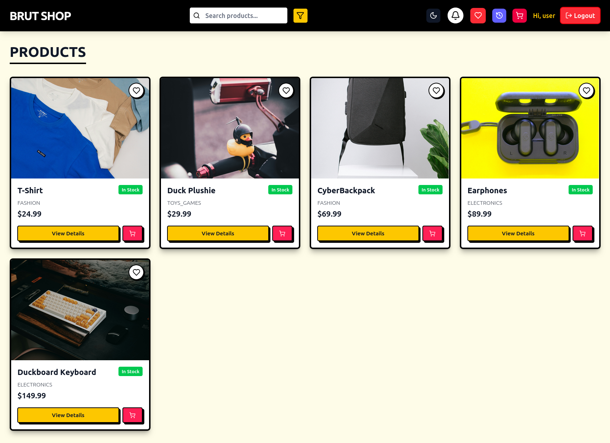
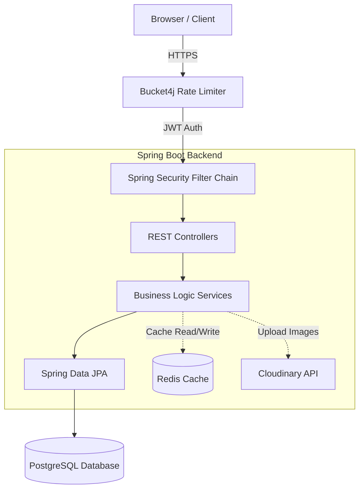

# 🛒 BrutShop

[](https://github.com/Sarcastic-Soul/E-commerce-Sprinboot/actions/workflows/deploy.yml)
[](https://springboot-ecommerce-latest-ctgu.onrender.com/)
[](https://springboot-ecommerce-latest-ctgu.onrender.com/swagger-ui/index.html)
[](LICENSE)


> Neo-brutalist full-stack e-commerce platform — **React 19** + **Spring Boot 3**, shipped as a single Docker monolith.

JWT auth with refresh tokens · role-based access · Razorpay checkout · wishlist & restock notifications · Redis caching · rate limiting · admin analytics.

---

## 🌐 Live Demo

| | Link |
|---|---|
| 🔗 **App** | [springboot-ecommerce-latest-ctgu.onrender.com](https://springboot-ecommerce-latest-ctgu.onrender.com/) |
| 📖 **API Docs (Swagger)** | [/swagger-ui/index.html](https://springboot-ecommerce-latest-ctgu.onrender.com/swagger-ui/index.html) |
| 📺 **Demo Video** | [youtu.be/o3MAQWqXyqA](https://youtu.be/o3MAQWqXyqA) |

> ⚠️ **Hosted on Render's free tier.** The server sleeps when idle — the first visit can take **2–5 minutes** to wake up. Watch the demo video if you'd rather not wait.

### 🔑 Demo Accounts

| Role | Username | Password |
|---|---|---|
| Standard user | `user` | `user123` |
| Admin | `admin` | `admin123` |

💡 The login page has **one-click buttons** for both accounts — no typing required.

---

## 📸 Preview



[](https://youtu.be/o3MAQWqXyqA)

---

## 🏛 Architecture


```mermaid
graph TD
    Client[Browser / Client] -->|HTTPS| RateLimiter[Bucket4j Rate Limiter]
    RateLimiter -->|JWT Auth| Security[Spring Security Filter Chain]

    subgraph Spring Boot Backend
        Security --> Controllers[REST Controllers]
        Controllers --> Services[Business Logic Services]
        Services --> Repositories[Spring Data JPA]

        Services -.->|Cache Read/Write| Redis[(Redis Cache)]
        Services -.->|Upload Images| Cloudinary[Cloudinary API]
    end

    Repositories --> Database[(PostgreSQL Database)]
```

- React is compiled into the Spring Boot JAR at build time → **one deployable artifact**.
- Vite proxies `/api` to `localhost:8080` in dev, so there's no CORS setup locally.

---

## 🔧 Tech Stack

| Layer | Technologies |
|---|---|
| **Frontend** | React 19 (Vite), Tailwind CSS 4, React Router 7, Axios, Recharts, Lucide, Sonner |
| **Backend** | Spring Boot 3.4 (Java 21), Spring Security + JWT, Spring Data JPA, Bucket4j |
| **Data** | PostgreSQL (Neon in prod), Redis (API cache + refresh-token TTL) |
| **Integrations** | Razorpay (payments, test mode), Cloudinary (image hosting) |
| **Testing** | JUnit 5, Mockito, Spring Security Test |
| **DevOps** | Docker (multi-stage), GitHub Actions, Render |

---

## ✨ Features

**🔐 Auth & Security**
- Short-lived JWT access tokens + Redis-backed refresh tokens.
- Role-based route protection (`ADMIN` / `USER`), enforced on both client and server.
- Per-user ownership checks on carts and notifications.
- IP-based rate limiting (30 req/min) on public endpoints via Bucket4j.

**🛍 Products & Discovery**
- Server-side pagination with Spring Data `Pageable`.
- Debounced search + Redis-cached product reads.
- Filter drawer: category, price range, availability, sorting.
- Wishlist with instant UI updates.

**🛒 Cart & Orders**
- Sliding cart drawer with live badge count.
- Razorpay checkout (test mode) with server-side signature verification.
- Stock deducts only after payment is verified, from the order snapshot.
- Order history with statuses: `PENDING` · `COMPLETED` · `REJECTED`.

**🔔 Notifications**
- Restocking a product from `0` → `≥1` notifies every user who wishlisted it.

**📊 Admin Dashboard**
- Totals for users, products, orders, revenue, and out-of-stock items.
- Recharts line chart of order trends over time.

---

## 💻 Local Setup

### Prerequisites

| Requirement | Notes |
|---|---|
| Java 21 | |
| Node.js 18+ | |
| PostgreSQL | Database named `brutshop`, or edit `application-dev.properties` |
| Redis | `docker run -p 6379:6379 redis` |
| Cloudinary account | Optional — needed only for image upload |
| Razorpay account | Optional — needed only for checkout (test keys) |

### 1. Backend

```bash
cp backend/secrets.properties.example backend/secrets.properties   # then fill it in
cd backend
./mvnw spring-boot:run -Dspring-boot.run.profiles=dev
```

- The app **runs with the file blank** — you'll just get a warning; image upload and payments won't work.
- `secrets.properties` is gitignored and dockerignored. It never leaves your machine.
- Real environment variables override the file: `JWT_SECRET=… ./mvnw …`.
- Defaults to the `prod` profile, so `-Dspring-boot.run.profiles=dev` is required locally.
- On first boot, `DevSeeder` creates the demo accounts and 15 sample products.

### 2. Frontend

```bash
cd frontend
echo "VITE_RAZORPAY_KEY_ID=rzp_test_your_key_here" > .env
npm install
npm run dev
```

Runs on **http://localhost:3000**.

---

## 🔑 Environment Variables

**Backend** — from `backend/secrets.properties` locally, real env vars in production:

| Variable | Required | Purpose |
|---|:---:|---|
| `JWT_SECRET` | ⚠️ **Yes in prod** | Signing key, 32+ chars. If unset, a random key is generated **per restart** and all sessions die with it. |
| `DB_URL` / `DB_USER` / `DB_PASS` | Prod only | PostgreSQL connection (dev uses localhost defaults) |
| `REDIS_URL` | Prod only | Redis connection (dev defaults to `redis://localhost:6379`) |
| `CLOUDINARY_CLOUD_NAME` | No | Image upload |
| `CLOUDINARY_API_KEY` | No | Image upload |
| `CLOUDINARY_API_SECRET` | No | Image upload |
| `RAZORPAY_KEY_ID` | No | Checkout |
| `RAZORPAY_KEY_SECRET` | No | Payment signature verification |
| `SPRING_PROFILES_ACTIVE` | Prod only | Set to `prod` |

> Generate a signing key with `openssl rand -base64 48`.

**GitHub Actions secrets** (required for CI/CD):

| Secret | Purpose |
|---|---|
| `DOCKER_USERNAME` / `DOCKER_PASSWORD` | Push the image to Docker Hub |
| `VITE_RAZORPAY_KEY_ID` | Baked into the frontend bundle at build time |
| `RENDER_DEPLOY_HOOK` | Triggers the Render deploy |

---

## 🚀 Deployment

1. Push to `main` → GitHub Actions builds the monolith Docker image and pushes it to Docker Hub.
2. The workflow then calls the Render deploy hook.
3. Render pulls the image and runs it with the environment variables above.

---

## 🧪 Tests

```bash
cd backend && ./mvnw test
```

27 tests across services, business logic, and endpoint authorization (JUnit 5 + Mockito + Spring Security Test).

---

## 📝 License

[MIT](LICENSE) — free to modify and use. Credit appreciated.

> Made by [Anish Kumar](https://github.com/Sarcastic-Soul)
