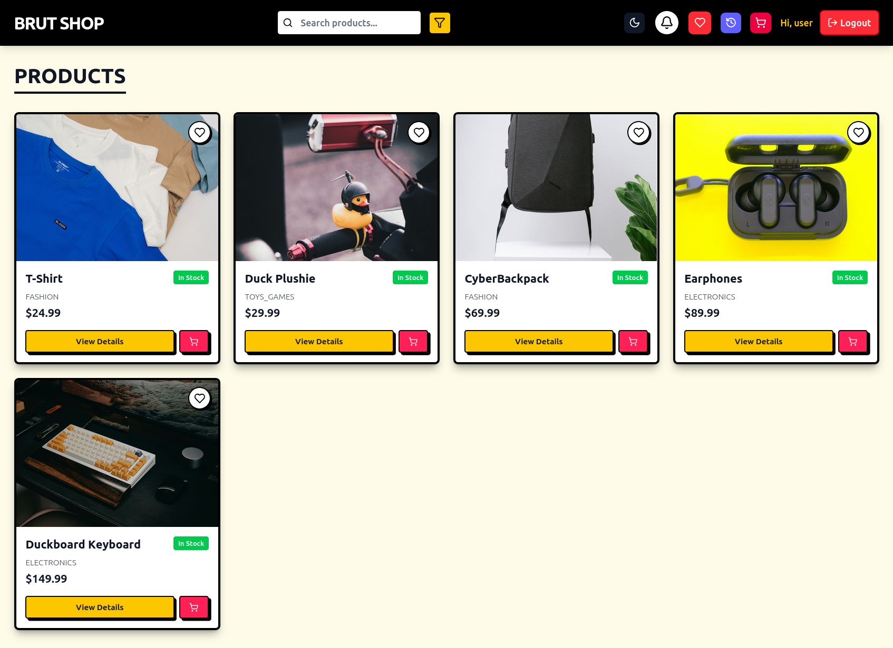
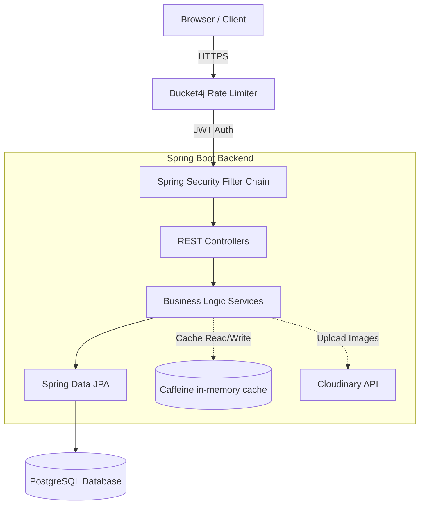

<div align="center">

# 🛒 BrutShop

**Neo-brutalist full-stack e-commerce** — React 19 + Spring Boot 3, shipped as a single Docker monolith.

[](https://github.com/Sarcastic-Soul/E-commerce-Sprinboot/actions/workflows/deploy.yml)
[](https://brutshop.vercel.app/)
[](https://brutshop.vercel.app/swagger-ui/index.html)
[](LICENSE)


### [🔗 Live App](https://brutshop.vercel.app/) · [📖 API Docs](https://brutshop.vercel.app/swagger-ui/index.html) · [📺 Demo Video](https://youtu.be/o3MAQWqXyqA)

JWT auth with refresh tokens · role-based access · Razorpay checkout · wishlist & restock notifications · in-memory caching · rate limiting · admin analytics



</div>

> ⚠️ **Free-tier hosting** — the server sleeps when idle. First visit takes **2–5 minutes** to wake up. Watch the [demo video](https://youtu.be/o3MAQWqXyqA) if you'd rather not wait.

### 🔑 Demo Accounts

| Role | Username | Password |
|---|---|---|
| Standard user | `user` | `user123` |
| Admin | `admin` | `admin123` |

💡 The login page has **one-click buttons** for both — no typing required.

---

## 🏛 Architecture


```mermaid
graph TD
    Client[Browser / Client] -->|HTTPS| RateLimiter[Bucket4j Rate Limiter]
    RateLimiter -->|JWT Auth| Security[Spring Security Filter Chain]

    subgraph Spring Boot Backend
        Security --> Controllers[REST Controllers]
        Controllers --> Services[Business Logic Services]
        Services --> Repositories[Spring Data JPA]

        Services -.->|Cache Read/Write| Cache[(Caffeine in-memory cache)]
        Services -.->|Upload Images| Cloudinary[Cloudinary API]
    end

    Repositories --> Database[(PostgreSQL Database)]
```

- React compiles into the Spring Boot JAR at build time → **one deployable artifact**.
- Vite proxies `/api` to `localhost:8080` in dev — no CORS setup needed locally.

---

## 🔧 Tech Stack

| Layer | Technologies |
|---|---|
| **Frontend** | React 19 (Vite 8), Tailwind CSS 4, React Router 7, Axios, Recharts, Phosphor Icons, Sonner |
| **Backend** | Spring Boot 4.1 (Java 21+, Java 25 in Docker), Spring Security + JWT, Spring Data JPA, Bucket4j |
| **Data** | PostgreSQL (Neon in prod: data, refresh tokens, login rate limits), Caffeine (in-memory catalog cache) |
| **Integrations** | Razorpay (payments, test mode), Cloudinary (image hosting) |
| **Testing** | JUnit 5, Mockito, Spring Security Test |
| **DevOps** | Docker (multi-stage), Vercel (static + container services), GitHub Actions |

---

## ✨ Features

**🔐 Auth & Security**
- Short-lived JWT access tokens + Postgres-backed refresh tokens.
- Role-based route protection (`ADMIN` / `USER`), enforced client- and server-side.
- Per-user ownership checks on carts and notifications.
- IP-based rate limiting (30 req/min) on public endpoints.

**🛍 Products & Discovery**
- Server-side pagination, debounced search, cached catalog reads (Caffeine, 60s).
- Filter drawer: category, price range, availability, sorting.
- Wishlist with instant UI updates.

**🛒 Cart & Orders**
- Sliding cart drawer with live badge count.
- Razorpay checkout with server-side signature verification.
- Stock deducts only after payment is verified, from the order snapshot.
- Order history: `PENDING` · `COMPLETED` · `REJECTED`.

**🔔 Notifications**
- Restocking a product from `0` → `≥1` notifies everyone who wishlisted it.

**📊 Admin Dashboard**
- Totals for users, products, orders, revenue, out-of-stock items.
- Recharts line chart of order trends over time.

---

## 💻 Local Setup

**Prerequisites:** Java 21 · Node 18+ · pnpm · PostgreSQL (database `brutshop`)

```bash
# 1. Backend → localhost:8080
cp backend/secrets.properties.example backend/secrets.properties    # optional, see below
cd backend && ./mvnw spring-boot:run -Dspring-boot.run.profiles=dev

# 2. Frontend → localhost:3000
cd frontend && pnpm install && pnpm dev
```

- `-Dspring-boot.run.profiles=dev` is **required** — the app defaults to `prod`.
- Starts fine with blank secrets; only image upload and checkout are affected.
- `DevSeeder` seeds the demo accounts and 15 sample products on first boot.

---

## 🔑 Environment Variables

Local values live in `backend/secrets.properties` (gitignored + dockerignored); production uses real env vars on Vercel. **Env vars override the file.**

| Variable | Scope | Purpose |
|---|---|---|
| `JWT_SECRET` | ⚠️ **Prod required** | Signing key, 32+ chars. Unset → new random key each restart, dropping every session. Generate: `openssl rand -base64 48` |
| `DB_URL` `DB_USER` `DB_PASS` | Prod | PostgreSQL — dev uses localhost defaults |
| `SPRING_PROFILES_ACTIVE` | Prod | Set to `prod` |
| `CLOUDINARY_CLOUD_NAME` `_API_KEY` `_API_SECRET` | Optional | Image upload |
| `RAZORPAY_KEY_ID` `_KEY_SECRET` | Optional | Checkout + signature verification. The frontend reads the key ID from `/api/payments/config`, so rotating keys needs no rebuild |
| `DB_POOL_SIZE` `DB_POOL_MIN_IDLE` | Serverless | Hikari pool per instance (default 10 / 2). Use 3 / 0 on Vercel: many small instances each open their own pool |
| `RATE_LIMIT_AUTH_STORE` | Serverless | Where the login/signup limit is counted: `memory` (default) or `postgres`. Use `postgres` when more than one instance serves traffic; catalog limits are always in memory |
| `CLIENT_IP_HEADER` | Serverless | Header with the real client IP for rate limiting. `x-real-ip` on Vercel |
| `APP_SCHEDULING_ENABLED` | Serverless | `false` on Vercel: no process stays up to run the 5-minute order-expiry timer |
| `CRON_SECRET` | Serverless | Enables `GET /api/internal/cleanup` (expire unpaid orders, delete expired refresh tokens and rate-limit rows), which Vercel Cron calls daily with `Authorization: Bearer <secret>` |
| `PORT` | Optional | Port to listen on (default 8080). Vercel sets it |

**GitHub Actions secrets:** `DOCKER_USERNAME` · `DOCKER_PASSWORD` · `RENDER_DEPLOY_HOOK`

---

## 🚀 Deployment

### Vercel (current)

One Vercel project, two services, set up in [`vercel.json`](vercel.json):

- `frontend/` builds as a static Vite site served from the CDN, so pages load instantly even while the backend is asleep.
- `backend/` runs as a container from [`backend/Dockerfile.vercel`](backend/Dockerfile.vercel) (1 vCPU, 2GB), in `sin1` next to the Neon database.
- `/api/*` and Swagger are routed to the backend on the same domain, so the auth cookies are first-party and third-party cookie blocking does not break login.

```bash
vercel deploy          # preview
vercel deploy --prod   # production
```

The backend scales to zero after 5 minutes without traffic. A cold start takes a few seconds: the image ships a JVM AOT cache and runs the JVM with only the C1 compiler, which roughly halves boot time on one core.

Serverless means no long-running process, so:
- unpaid orders are expired before each checkout (at most once per 5 minutes per instance) and by a daily Vercel Cron call to `/api/internal/cleanup`;
- login/signup rate limits are counted in Postgres so all instances share them; catalog limits stay per instance in memory;
- the catalog cache is per instance with a 60s lifetime, so an admin edit shows everywhere within a minute.

No Redis: Postgres (Neon) is the only backing service.

Request bodies are capped at 4.5MB by Vercel, so image uploads are limited to 4MB.

Push to `main` and Vercel builds and deploys through its GitHub integration. Pull requests get preview deploys. GitHub Actions (`.github/workflows/ci.yml`) only runs the backend tests and the frontend lint and build.

### Self-hosting (single container)

The root `Dockerfile` still builds the frontend into the Spring Boot JAR as one image, for any host that runs Docker (it was used for Render before the move to Vercel).

---

## 🧪 Tests

```bash
cd backend && ./mvnw test
```

114 tests across services, business logic, and endpoint authorization (JUnit 5 · Mockito · Spring Security Test).

---

<div align="center">

**[MIT](LICENSE)** © [Anish Kumar](https://github.com/Sarcastic-Soul)

</div>
